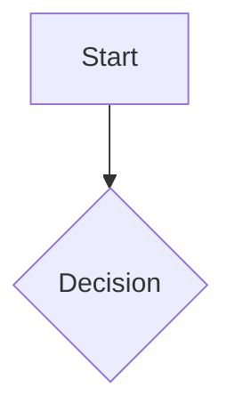

## Mermaid 图表输出规范

当需要在终端输出中展示结构化关系、流程、架构时，使用 mermaid 代码块。终端环境会自动将 mermaid 块渲染为 Unicode 图形。

当内容包含流程、状态转换、模块依赖、调用关系、数据流、时序交互、分类关系或对比结构时，优先考虑使用 mermaid 图表辅助表达。对于仅用段落或列表难以清晰呈现的结构化信息，应主动使用 mermaid，使关系更易阅读、检查和讨论。

### 语法要求

使用标准 mermaid 语法，以 fenced code block 形式输出：

### 终端直接输出限制

直接输出到终端的 mermaid 块会被即时渲染为 Unicode 图形。由于终端渲染器的字符宽度计算限制：

- 节点标签、边标签、所有文本内容只允许使用 ASCII 字符
- 禁止使用中文、日文、韩文等多字节字符
- 禁止使用 emoji
- 写入文件的 mermaid 内容不受此限制

### 允许使用的图表类型

- flowchart / graph (流程图)
- sequenceDiagram (时序图)
- classDiagram (类图)
- erDiagram (ER 图)
- stateDiagram-v2 (状态图)
- block-beta (块图)
- gitGraph (Git 图)
- pie (饼图)
- mindmap (思维导图)
- timeline (时间线)
- kanban (看板)
- journey (用户旅程)
- xychart-beta (XY 图表)
- quadrantChart (象限图)
